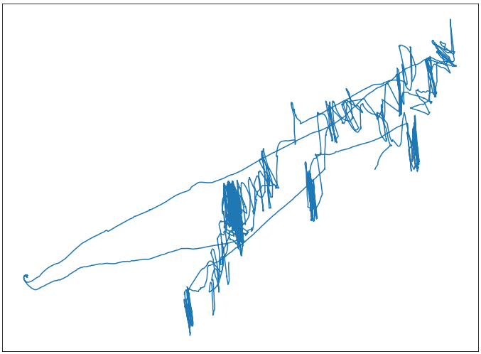
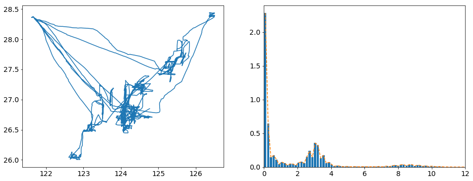
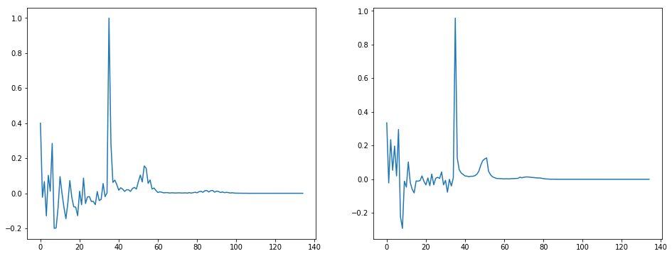
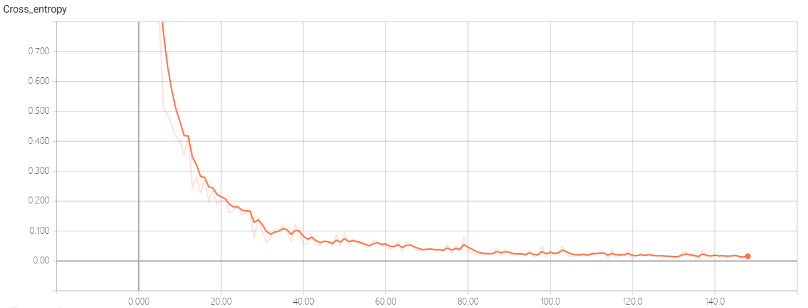

# 特征分析

_PS：建议 180% 以上倍率查看 [README.pdf](README.pdf)，否则可能导致某些图像边缘坐标信息的丢失，可以通过书签页迅速跳转查看各章节，或者查看显示效果更佳的 [HTML格式的说明文档](README.html)。_

## 可用于识别的特征类型

- 航速：拖网最高（），其次为刺网（），最低为张网（）。[浙江数字渔场建设工作方案](浙江数字渔场建设工作方案2019529l.doc) 给出的各类型渔船航速的数据显示，总体速度波动较大，但基本都存在一个稳定的作业速度，所以可以先对速度检测曲线进行类似下图的平滑处理，减少速度曲线的波动。  

  <div align='center'>
  
  </div>

- 航向（轨迹图）：经过观察分析发现各类型渔船的航向图有着各自类型独有的特点，比如拖网航向变化很频繁，轨迹图形成多个集中的区域；张网的航向变化很少，轨迹图多为直线；刺网兼有拖网及张网的特点，需要预处理后才能区分。可以尝试通过卷积神经网络对航向图像进行分类处理（**已画出所有拖网船型的轨迹图，无明显可区分特征，未经预处理不适合卷积神经网络直接分类**）。  

  <div align='center'>
  
  </div>

- 航速比：相同类型船只的航速比去除掉一些奇异点之后的直方图拟合曲线具有一定的相似性，具有较强的可区分特征。可以尝试用卷积神经网络做分类（航速比直方图拟合曲线图多为背景信息，图像信息较少，可能结果不是很好，作为第二方案）。  
- 航速变化率及航向变化率：可以尝试将航速变化率及航向变化划分为几个区域，然后在这些区域内提取不同的统计学特征用来表征这个类型的船只，关键点在于如何选择合适的区域使得提取的特征具有可区分性。

  <div align='center'>
  
  </div>


# 第一方案（特征提取及分类）

## 拖网数据分析及特征提取

- **拖网类型船只的总样本数（船号数）为 `445`**，总的数据组数为 `17,730,700`，其中船号为 `47292` 的拖网渔船拥有最少记录数据 `20,922` 组，拥有最多记录数据的船号为 `50029`，包含 `63,356` 组：

  <table align="center" style="height:160;width:730;" border="1">
  <tr>
    <th align="center" width="292">船号</th>
    <th align="center" width="438">数据总数（组）</th>
  </tr>
  <tr>
    <td align="center">47292（最少数据）</td>
    <td align="center">20,922</td>
  </tr>
  <tr>
    <td align="center">50029（最多数据）</td>
    <td align="center">63,356</td> 
  </tr>
  <tr>
    <th align="center">所有拖网船只</th>
    <th align="center">17,730,700</th>
  </tr>
  </table>
  
  
  
  其中，船号31436，第3411、3412航速数据错误。
  
- **拖网数据特点:** 航速在 及  附近的权重较大，这点与其它两种类型的船只差别较大，因而该航速比直方图特征可直接作为部分的拖网船型的特征（为防止可能存在的错误航速数据的影响，设定航速最大值 ，然后归一化处理）。

  <div align='center'>
  
  </div>  
  
- 通过先对经、纬度坐标信息做降维去相关处理，然后可以得到每条渔船的  维的特征，随后通过对特征固定数量的采样确保每条渔船的特征维数（暂时取 `1000` 维）都相同。

  <div align='center'>
  
  </div>  

- 接着使用主成分分析法从这些 `1000` 维特征中提取出 `M` 维的特征向量（暂时先取 `35` 维）并做归一化处理，最后将该特征与速占比特征（`100` 维）结合得到该条渔船最终的特征（`135` 维）。

- 下图是前两条拖网渔船的最终特征（Intel(R) Xeon(R) CPU @ 2.30GHz下，该类型所有船只的特征提取总耗时约 `1511` 秒）。

  <div align='center'>
  
  </div>  

## 张网数据分析及特征提取

- **张网类型船只的总样本数（船号数）为 `77`**，总的数据组数为 `2,875,900`，其中船号为 `35234` 的张网渔船拥有最少记录数据 `20,557` 组，拥有最多记录数据的船号为 `55430`，包含 `57,307` 组：

  <table align="center" style="height:160;width:730;" border="1">
  <tr>
    <th align="center" width="292">船号</th>
    <th align="center" width="438">数据总数（组）</th>
  </tr>
  <tr>
    <td align="center">35234（最少数据）</td>
    <td align="center">20,557</td>
  </tr>
  <tr>
    <td align="center">55430（最多数据）</td>
    <td align="center">57,307</td>
  </tr>
  <tr>
    <th align="center">所有张网船只</th>
    <th align="center">2,875,900</th>
  </tr>
  </table>
  
- **张网数据特点:** 航速在  之间分布较多，这点与刺网相似，但是张网的航线轨迹图的 **目标地点** 更加的明确，侧面反映该类渔船的航向变化不是很频繁，这点与其它两种类型的船只差别较大。  
  
  <div align='center'>
  
  </div>
  
- 通过与拖网渔船相同的操作，可以得到该条张网渔船的采样特征。该特征与其它两类船型有着明显的差异性，在一定区域内较为平稳，且有着近似周期的性质。

  <div align='center'>
  
  </div>

- 前两条张网渔船的最终 `135` 维特征（该类型所有船只的特征提取总耗时约 `243` 秒）。

  <div align='center'>
  
  </div>

## 刺网数据分析及特征提取

- **刺网类型船只的总样本数（船号数）为 `173`**，总的数据组数为 `8,481,908`，其中船号为 `52251` 的刺网渔船拥有最少记录数据 `25,871` 组，拥有最多记录数据的船号为 `28824`，包含 `63,410` 组：

  <table align="center" style="height:160;width:730;" border="1">
  <tr>
    <th align="center" width="292">船号</th>
    <th align="center" width="438">数据总数（组）</th>
  </tr>
  <tr>
    <td align="center">52251（最少数据）</td>
    <td align="center">25,871</td>
  </tr>
  <tr>
    <td align="center">28824（最多数据）</td>
    <td align="center">63,410</td>
  </tr>
  <tr>
    <th align="center">所有刺网船只</th>
    <th align="center">8,481,908</th>
  </tr>
  </table>
  
- **刺网数据特点:** 速度直方图分布与张网类型的船只很像，在航线轨迹图上与拖网十分的相似（都在频繁的改变航向）。

  <div align='center'>
  
  </div>
  
- 通过同样的数据预处理操作，可以得到该条刺网渔船的采样特征。该采样特征与其它两类船型的采样特征相比，波动性很明显，是非常好的可区分特征。

  <div align='center'>
  
  </div>

- 前两条刺网渔船的最终 `135` 维特征（该类型所有船只的特征提取总耗时约 `710` 秒）。

  <div align='center'>
  
  </div>  

## 特征分类

#### 1.1 神经网络分类（拖、张、刺网三种类型船只）

对上述提取的特征采用包含 `2` 个隐层的神经网络做分类，网络结构如下所示：

  <div align='center'>
  
  </div>  

对 `3` 种类型共 `695` 条渔船做分类识别，结果如下所示：  

```python
Epoch 1, cross_entropy: 0.8688, accuracy: 64.84%.
Epoch 10, cross_entropy: 0.2746, accuracy: 89.84%.
Epoch 20, cross_entropy: 0.1436, accuracy: 94.53%.
Epoch 30, cross_entropy: 0.0974, accuracy: 97.66%.
Epoch 40, cross_entropy: 0.0647, accuracy: 98.44%.
Epoch 50, cross_entropy: 0.0174, accuracy: 100.00%.
Epoch 60, cross_entropy: 0.0215, accuracy: 100.00%.
Epoch 70, cross_entropy: 0.0161, accuracy: 99.22%.
Epoch 80, cross_entropy: 0.0323, accuracy: 99.22%.
Epoch 90, cross_entropy: 0.0462, accuracy: 98.44%.
Epoch 100, cross_entropy: 0.0179, accuracy: 100.00%.
Epoch 110, cross_entropy: 0.0072, accuracy: 100.00%.
Epoch 120, cross_entropy: 0.0125, accuracy: 100.00%.
Epoch 130, cross_entropy: 0.0077, accuracy: 100.00%.
Epoch 140, cross_entropy: 0.0119, accuracy: 100.00%.
Epoch 150, cross_entropy: 0.0078, accuracy: 100.00%.
Training completed.

Cross_entropy on the whole training set: 0.0034, accuracy: 100.00%.
```

通过 `Tensorboard` 进行可视化处理后得到识别精度随迭代次数的变化（由于尚未对特征参数及网络结构优化，所以训练后期仍存在 `0.5%` 的较小精度波动）：

  <div align='center'>
  
  </div>  

以及交叉熵损失随迭代次数的变化：

  <div align='center'>
  
  </div>  

#### 1.2 神经网络分类（所有七种类型船只）

采用上述相同的网络结构对 `7` 种类型（拖网、张网、刺网、笼壶、钓具、杂渔具、围网）共 `951` 条渔船做分类识别，结果如下所示：

```python
Epoch 1, cross_entropy: 1.6541, accuracy: 39.06%.
Epoch 10, cross_entropy: 0.4156, accuracy: 88.28%.
Epoch 20, cross_entropy: 0.1895, accuracy: 92.19%.
Epoch 30, cross_entropy: 0.1489, accuracy: 94.53%.
Epoch 40, cross_entropy: 0.0976, accuracy: 96.09%.
Epoch 50, cross_entropy: 0.0540, accuracy: 98.44%.
Epoch 60, cross_entropy: 0.0474, accuracy: 98.44%.
Epoch 70, cross_entropy: 0.0320, accuracy: 98.44%.
Epoch 80, cross_entropy: 0.0783, accuracy: 95.31%.
Epoch 90, cross_entropy: 0.0357, accuracy: 98.44%.
Epoch 100, cross_entropy: 0.0133, accuracy: 100.00%.
Epoch 110, cross_entropy: 0.0147, accuracy: 100.00%.
Epoch 120, cross_entropy: 0.0304, accuracy: 99.22%.
Epoch 130, cross_entropy: 0.0150, accuracy: 100.00%.
Epoch 140, cross_entropy: 0.0141, accuracy: 100.00%.
Epoch 150, cross_entropy: 0.0151, accuracy: 100.00%.
Training completed.

Cross_entropy on the whole training set: 0.0089, accuracy: 100.00%.
```
通过可视化处理后得到识别精度随迭代次数的变化（由于船只类型及样本数的增加，当采用与之前相同的网络结构做分类时，网络对随机小批量样本的识别精度的波动也变大，**因而我在不改变总体网络结构的情况下微调了几个超参**，使得网络能保持在 `3` 种类型船只分类任务上的表现）：

  <div align='center'>
  
  </div>  

交叉熵损失随迭代次数的变化：

  <div align='center'>
  
  </div>  

#### 2.1 小波神经网络分类（拖、张、刺网三种类型船只）

#### 2.2 小波神经网络分类（所有七种类型船只）

-----
**脚注 (Footnote)**

<a name='fn1'>[1]</a>: [Othmani M, Khlifi Y. 3D Object Model Reconstruction Based on Polywogs Wavelet Network Parametrization[J]. World Academy of Science, Engineering and Technology, International Journal of Computer, Electrical, Automation, Control and Information Engineering, 2016, 10(7): 1289-1294.](https://pdfs.semanticscholar.org/00c7/a935a8135c3c2e7cba2d869e42d2cbbfdc60.pdf)   